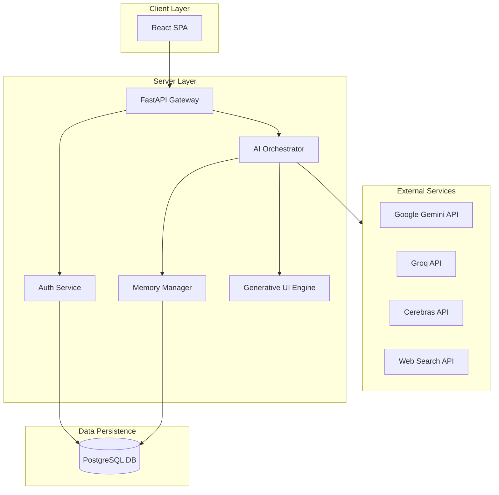
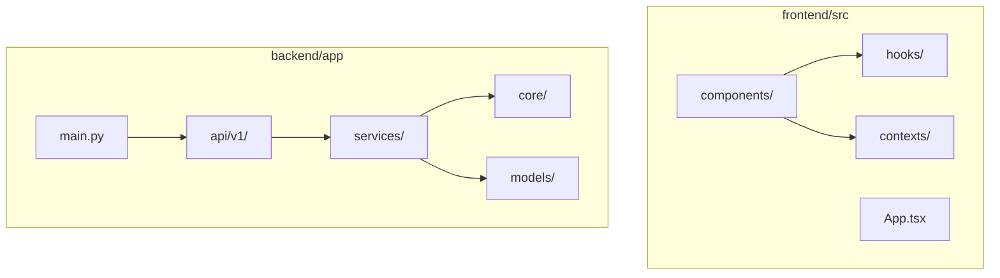
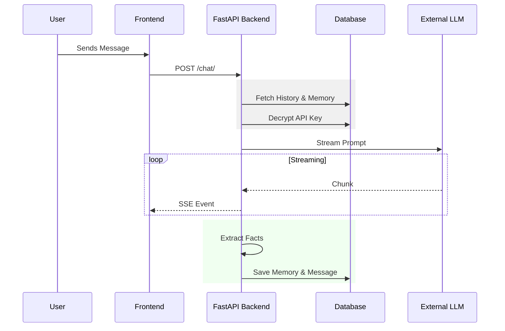
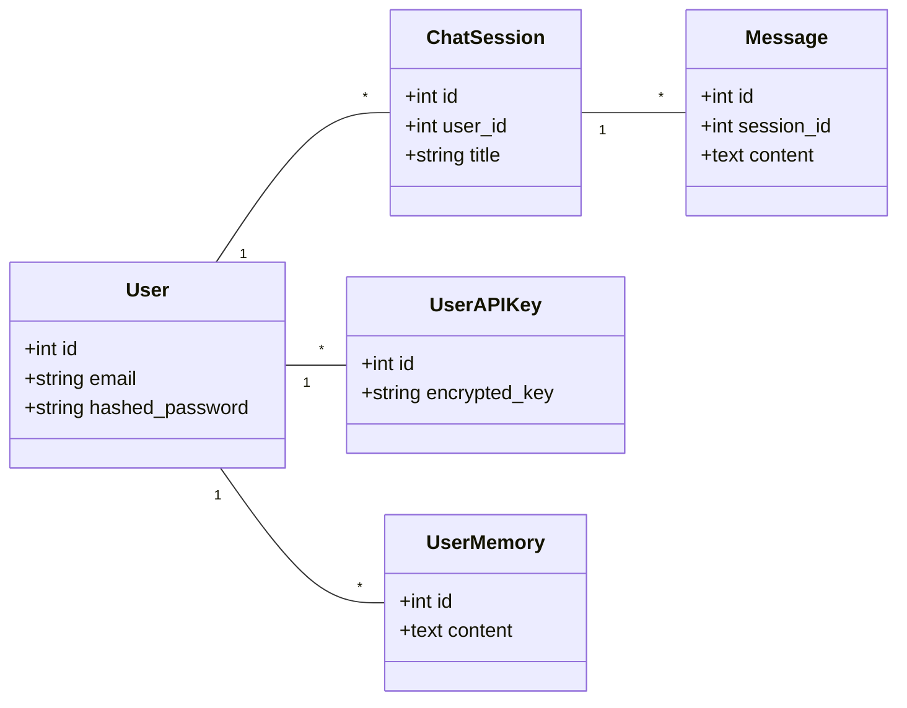

# System Design: ChatNova

**Last Updated:** January 22, 2026

## 1. Introduction

ChatNova is a multi-provider AI chat platform bridging LLM text outputs and interactive visual experiences. It utilizes a **Bring Your Own Key (BYOK)** architecture and Generative UI to render charts dynamically.

---

## 2. Architectural Views

### 2.1. Logical View

This diagram illustrates the high-level logical components and their interactions.

### 2.2. Development View

The organization of the source code follows a strict separation of concerns between the React frontend and modular Python backend.

### 2.3. Process View

**Use Case 1: Chat Message Flow with Memory**

---

## 3. Data Design

### 3.1. Core Data Model

The database schema centers around the `User`, who owns `ChatSessions`, `APIKeys`, and `Memories`.

