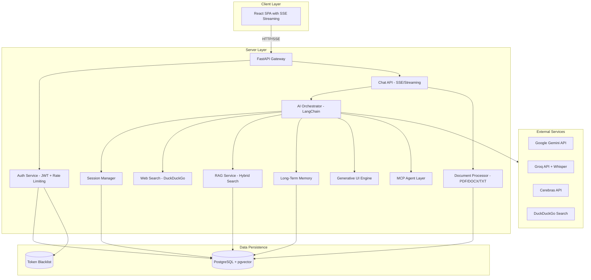
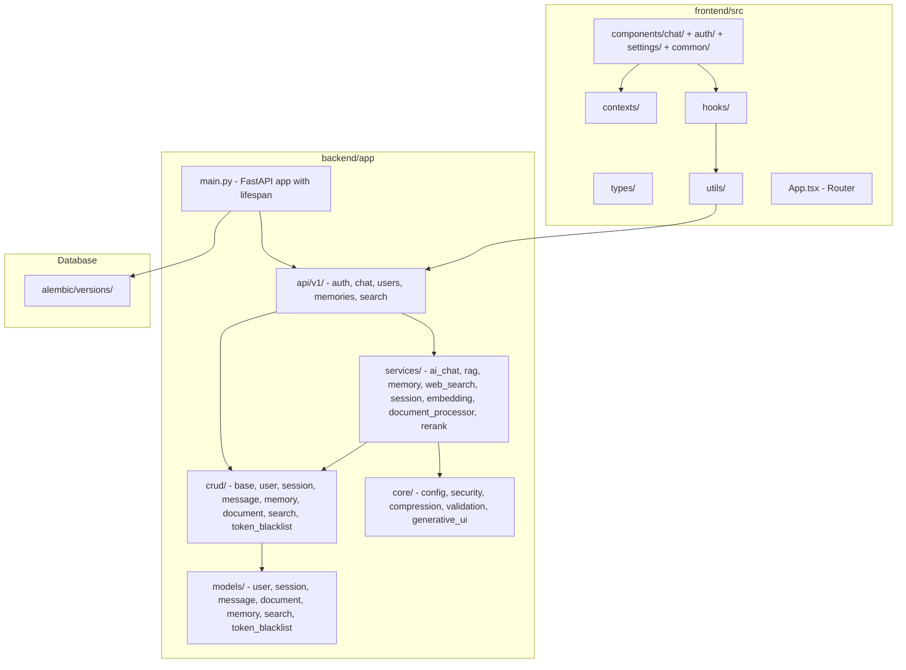
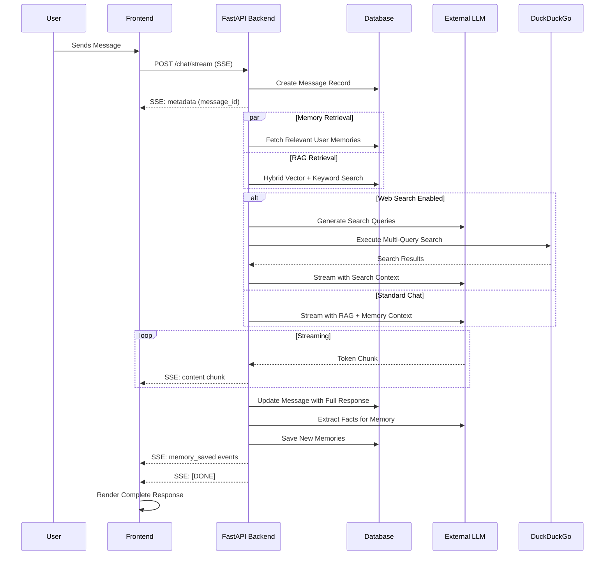
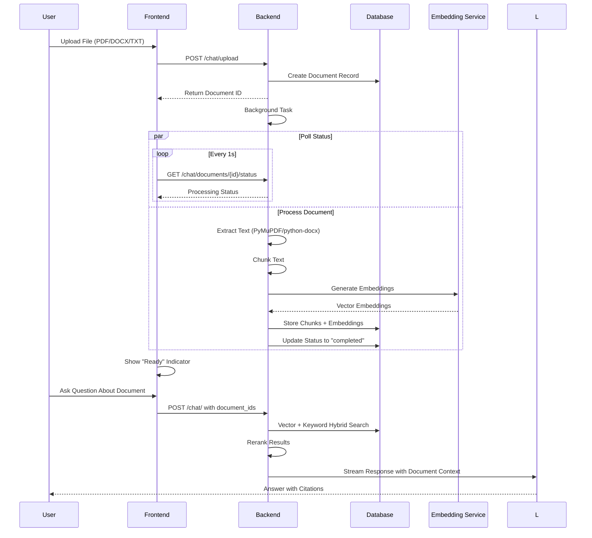
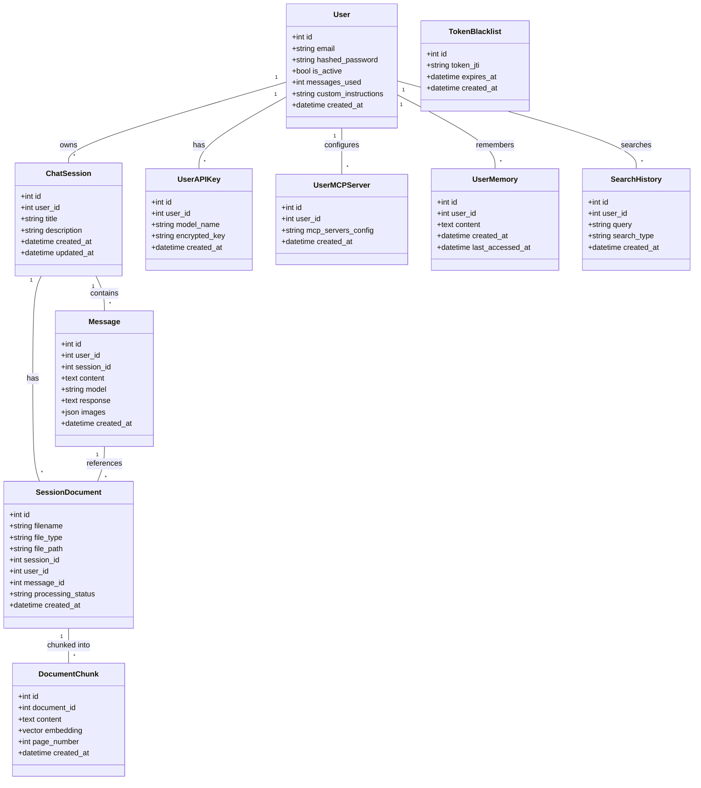

# System Design: ChatNova

**Last Updated:** June 12, 2026

## 1. Introduction

ChatNova is a multi-provider AI chat platform bridging LLM text outputs and interactive visual experiences. It features a **Bring Your Own Key (BYOK)** architecture, Multi-Modal RAG (Retrieval-Augmented Generation), web search integration, MCP (Model Context Protocol) agent support, long-term user memory, audio transcription, and Generative UI for dynamic chart/gallery rendering.

---

## 2. Architectural Views

### 2.1. Logical View

This diagram illustrates the high-level logical components and their interactions.


```mermaid
graph TB
    subgraph ClientLayer [Client Layer]
        SPA[React SPA with SSE Streaming]
    end

    subgraph ServerLayer [Server Layer]
        Gateway[FastAPI Gateway]
        Auth[Auth Service - JWT + Rate Limiting]
        ChatAPI[Chat API - SSE/Streaming]
        SessionSvc[Session Manager]
        SearchSvc[Web Search - DuckDuckGo]
        RagSvc[RAG Service - Hybrid Search]
        MemorySvc[Long-Term Memory]
        AIOrch[AI Orchestrator - LangChain]
        GenUI[Generative UI Engine]
        MCP[MCP Agent Layer]
        DocProc[Document Processor - PDF/DOCX/TXT]
    end

    subgraph DataPersistence [Data Persistence]
        DB[(PostgreSQL + pgvector)]
        TokenBlacklist[(Token Blacklist)]
    end

    subgraph ExternalServices [External Services]
        Gemini[Google Gemini API]
        Groq[Groq API + Whisper]
        Cerebras[Cerebras API]
        SearchAPI[DuckDuckGo Search]
    end

    SPA -->|HTTP/SSE| Gateway
    Gateway --> Auth
    Gateway --> ChatAPI
    ChatAPI --> AIOrch
    AIOrch --> SessionSvc
    AIOrch --> SearchSvc
    AIOrch --> RagSvc
    AIOrch --> MemorySvc
    AIOrch --> GenUI
    AIOrch --> MCP
    AIOrch --> ExternalServices
    SessionSvc --> DB
    MemorySvc --> DB
    RagSvc --> DB
    Auth --> DB
    Auth --> TokenBlacklist
    DocProc --> DB
    ChatAPI --> DocProc

```

### 2.2. Development View

The source code follows strict separation of concerns between the React frontend and modular Python backend.


```mermaid
graph TD
    subgraph Frontend [frontend/src]
        Components[components/chat/ + auth/ + settings/ + common/]
        Hooks[hooks/]
        Contexts[contexts/]
        Types[types/]
        Utils[utils/]
        App[App.tsx - Router]
    end

    subgraph Backend [backend/app]
        API[api/v1/ - auth, chat, users, memories, search]
        Core[core/ - config, security, compression, validation, generative_ui]
        Models[models/ - user, session, message, document, memory, search, token_blacklist]
        Services[services/ - ai_chat, rag, memory, web_search, session, embedding, document_processor, rerank]
        CRUD[crud/ - base, user, session, message, memory, document, search, token_blacklist]
        Main[main.py - FastAPI app with lifespan]
    end

    subgraph DataLayer [Database]
        Migrations[alembic/versions/]
    end

    Main --> API
    API --> Services
    API --> CRUD
    Services --> Core
    Services --> CRUD
    CRUD --> Models
    Main --> Migrations
    Components --> Hooks
    Components --> Contexts
    Hooks --> Utils
    Utils --> API
```

### 2.3. Process Views

**Use Case 1: Streaming Chat with Web Search + Memory**


```mermaid
sequenceDiagram
    participant U as User
    participant F as Frontend
    participant B as FastAPI Backend
    participant D as Database
    participant L as External LLM
    participant W as DuckDuckGo

    U->>F: Sends Message
    F->>B: POST /chat/stream (SSE)
    B->>D: Create Message Record
    B-->>F: SSE: metadata (message_id)
    
    par Memory Retrieval
        B->>D: Fetch Relevant User Memories
    and RAG Retrieval
        B->>D: Hybrid Vector + Keyword Search
    end
    
    alt Web Search Enabled
        B->>L: Generate Search Queries
        B->>W: Execute Multi-Query Search
        W-->>B: Search Results
        B->>L: Stream with Search Context
    else Standard Chat
        B->>L: Stream with RAG + Memory Context
    end
    
    loop Streaming
        L-->>B: Token Chunk
        B-->>F: SSE: content chunk
    end
    
    B->>D: Update Message with Full Response
    B->>L: Extract Facts for Memory
    B->>D: Save New Memories
    B-->>F: SSE: memory_saved events
    B-->>F: SSE: [DONE]
    F->>F: Render Complete Response
```

**Use Case 2: Document Upload + RAG Pipeline**


```mermaid
sequenceDiagram
    participant U as User
    participant F as Frontend
    participant B as Backend
    participant D as Database
    participant E as Embedding Service

    U->>F: Upload File (PDF/DOCX/TXT)
    F->>B: POST /chat/upload
    B->>D: Create Document Record
    B-->>F: Return Document ID
    B->>B: Background Task
    
    par Poll Status
        loop Every 1s
            F->>B: GET /chat/documents/{id}/status
            B-->>F: Processing Status
        end
    and Process Document
        B->>B: Extract Text (PyMuPDF/python-docx)
        B->>B: Chunk Text
        B->>E: Generate Embeddings
        E-->>B: Vector Embeddings
        B->>D: Store Chunks + Embeddings
        B->>D: Update Status to "completed"
    end
    
    F->>F: Show "Ready" Indicator
    U->>F: Ask Question About Document
    F->>B: POST /chat/ with document_ids
    B->>D: Vector + Keyword Hybrid Search
    B->>B: Rerank Results
    B->>L: Stream Response with Document Context
    L-->>U: Answer with Citations
```

---

## 3. Data Design

### 3.1. Complete Data Model


```mermaid
classDiagram
    class User {
        +int id
        +string email
        +string hashed_password
        +bool is_active
        +int messages_used
        +string custom_instructions
        +datetime created_at
    }
    class ChatSession {
        +int id
        +int user_id
        +string title
        +string description
        +datetime created_at
        +datetime updated_at
    }
    class Message {
        +int id
        +int user_id
        +int session_id
        +text content
        +string model
        +text response
        +json images
        +datetime created_at
    }
    class UserAPIKey {
        +int id
        +int user_id
        +string model_name
        +string encrypted_key
        +datetime created_at
    }
    class UserMCPServer {
        +int id
        +int user_id
        +string mcp_servers_config
        +datetime created_at
    }
    class UserMemory {
        +int id
        +int user_id
        +text content
        +datetime created_at
        +datetime last_accessed_at
    }
    class SessionDocument {
        +int id
        +string filename
        +string file_type
        +string file_path
        +int session_id
        +int user_id
        +int message_id
        +string processing_status
        +datetime created_at
    }
    class DocumentChunk {
        +int id
        +int document_id
        +text content
        +vector embedding
        +int page_number
        +datetime created_at
    }
    class SearchHistory {
        +int id
        +int user_id
        +string query
        +string search_type
        +datetime created_at
    }
    class TokenBlacklist {
        +int id
        +string token_jti
        +datetime expires_at
        +datetime created_at
    }

    User "1" -- "*" ChatSession : owns
    ChatSession "1" -- "*" Message : contains
    ChatSession "1" -- "*" SessionDocument : has
    SessionDocument "1" -- "*" DocumentChunk : chunked into
    Message "1" -- "*" SessionDocument : references
    User "1" -- "*" UserAPIKey : has
    User "1" -- "*" UserMCPServer : configures
    User "1" -- "*" UserMemory : remembers
    User "1" -- "*" SearchHistory : searches
```

---

## 4. Key Architecture Decisions

### 4.1. AI Provider Integration

ChatNova uses **LangChain** to abstract LLM provider differences. Three providers are supported:

| Provider | Models | LangChain Integration |
|----------|--------|----------------------|
| Google | gemini-2.5-flash | `ChatGoogleGenerativeAI` |
| Cerebras | zai-glm-4.7 | `ChatCerebras` |
| Groq | moonshotai/kimi-k2-instruct-0905, Whisper (audio) | `ChatGroq` + `groq` SDK |

### 4.2. API Key Resolution (BYOK)

1. Check user-level encrypted keys in `user_api_keys` table
2. Fall back to environment variables (`GOOGLE_API_KEY`, etc.)
3. Keys encrypted with Fernet symmetric encryption

### 4.3. RAG Pipeline

1. **Document Ingestion**: Extract text (PyMuPDF/python-docx), chunk (RecursiveCharacterTextSplitter), embed (Google text-embedding-004), store in pgvector
2. **Query**: Hybrid search (vector cosine distance + keyword ILIKE) → deduplicate → rerank (FlashRank)
3. **Response**: Inject into LLM context with source citations

### 4.4. MCP Agent Architecture

Users can configure custom MCP servers. The backend uses `mcp-use` library with `MCPClient` and `MCPAgent` for tool execution. Agent streaming supports real-time tool call events (tool_start/tool_end) via SSE.

### 4.5. Streaming Architecture

All chat responses use **Server-Sent Events (SSE)** with JSON-encoded events:
- `metadata` - message ID after DB creation
- `content` - response text chunks
- `tool_start` / `tool_end` - agent tool execution events  
- `memory_saved` - when new memories are extracted
- `[DONE]` - stream termination

### 4.6. Security Measures

- JWT tokens stored in HTTP-only cookies
- Token blacklisting on logout
- Rate limiting (SlowAPI) - 10 req/min (prod), 100 req/min (test)
- Input sanitization with PII masking and prompt injection detection
- Output moderation for harmful content patterns
- CORS with specific origin whitelist
- Security headers middleware
- Response compression middleware

---

## 5. Build & Run

```bash
# Docker (full stack)
docker-compose up --build

# Local Development
docker-compose up db -d
cd backend && uv run alembic upgrade head && uv run uvicorn app.main:app --reload --host 0.0.0.0 --port 8000
cd frontend && pnpm dev

# Tests
cd backend && PYTHONPATH=. uv run pytest
cd frontend && pnpm test -- --run
```

---

## 6. API Endpoints

| Method | Path | Description |
|--------|------|-------------|
| POST | /api/v1/auth/register | User registration |
| POST | /api/v1/auth/login | User login (JWT cookie) |
| POST | /api/v1/auth/logout | Logout + blacklist token |
| POST | /api/v1/chat | Non-streaming chat |
| POST | /api/v1/chat/stream | SSE streaming chat |
| POST | /api/v1/chat-with-tools | MCP agent chat (non-streaming) |
| POST | /api/v1/chat/agent-stream | MCP agent chat (SSE streaming) |
| GET | /api/v1/chat/models | List available models |
| POST | /api/v1/chat/models/test | Test all models |
| POST | /api/v1/chat/models/test/{provider} | Test specific provider key |
| GET | /api/v1/chat/history | Paginated chat history |
| DELETE | /api/v1/chat/history | Clear history |
| POST | /api/v1/chat/upload | Upload document |
| GET | /api/v1/chat/documents/{id}/preview | Preview PDF |
| GET | /api/v1/chat/documents/{id}/status | Document processing status |
| POST | /api/v1/chat/transcribe | Audio transcription |
| POST | /api/v1/sessions | Create session |
| GET | /api/v1/sessions | List sessions |
| GET | /api/v1/sessions/{id} | Get session |
| PUT | /api/v1/sessions/{id} | Update session |
| DELETE | /api/v1/sessions/{id} | Delete session |
| GET | /api/v1/sessions/{id}/messages | Session messages |
| GET | /api/v1/memories | List memories |
| POST | /api/v1/memories | Create memory |
| DELETE | /api/v1/memories/{id} | Delete memory |
| GET | /api/v1/search/ | Search history |
| POST | /api/v1/search/ | Save search |
| GET | /api/v1/users/me | Current user profile |
| PUT | /api/v1/users/me | Update profile |
| PUT | /api/v1/users/me/instructions | Update custom instructions |
| GET | /api/v1/users/me/api-keys | List user API keys |
| POST | /api/v1/users/me/api-keys | Save API key |
| DELETE | /api/v1/users/me/api-keys/{id} | Delete API key |
| GET | /api/v1/users/me/mcp-servers | List MCP servers |
| POST | /api/v1/users/me/mcp-servers | Save MCP config |
| DELETE | /api/v1/users/me/mcp-servers/{id} | Delete MCP server |
